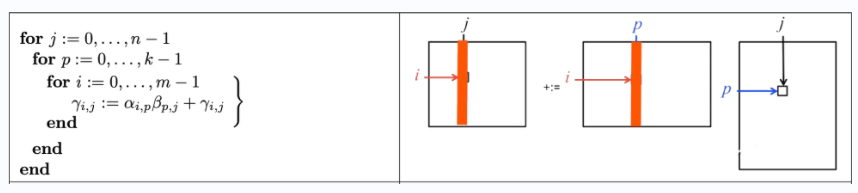
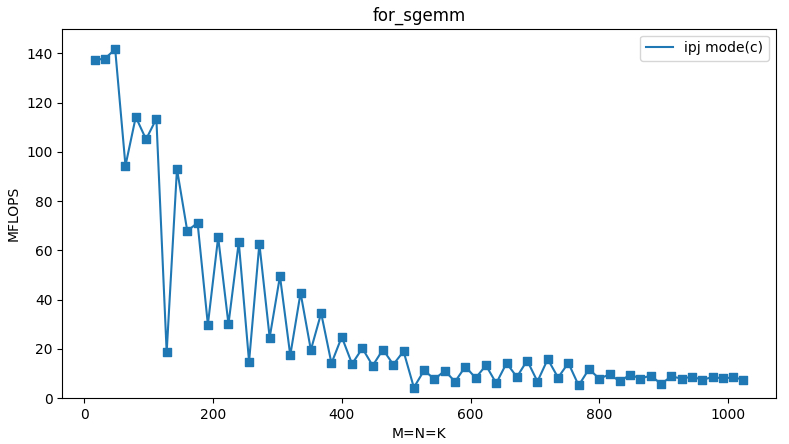
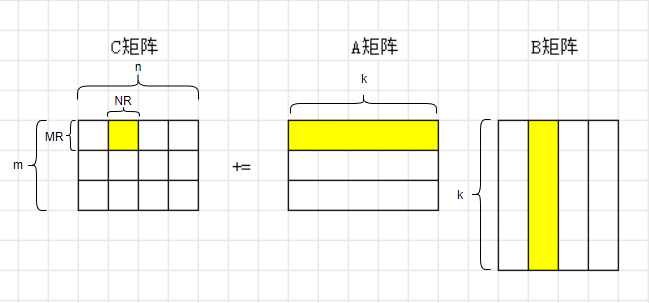
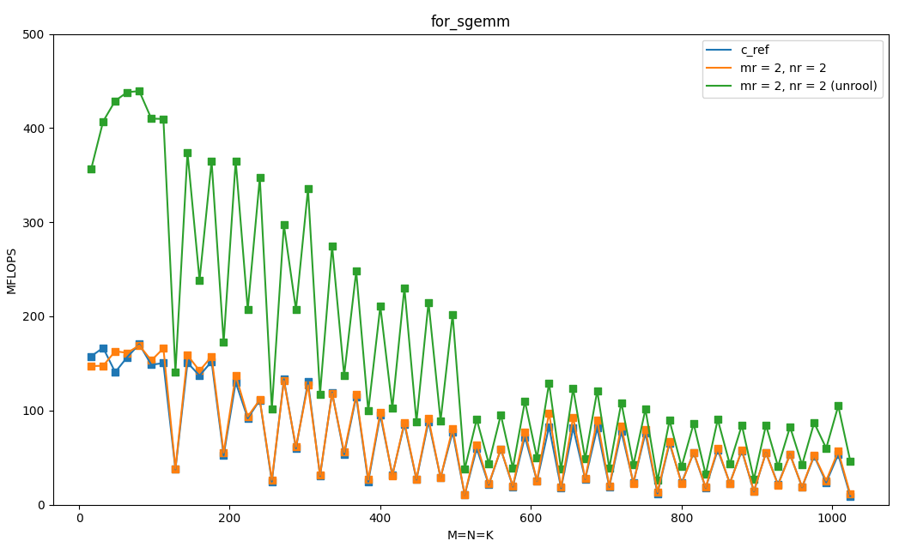
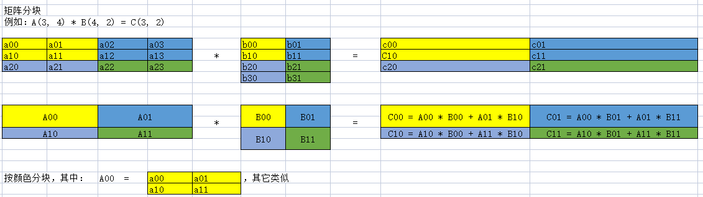
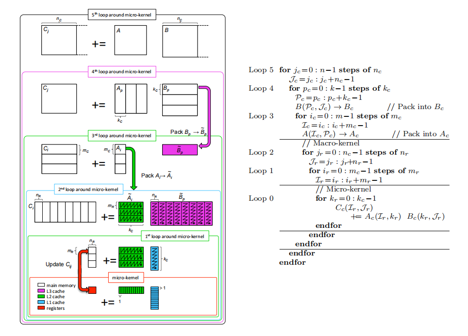
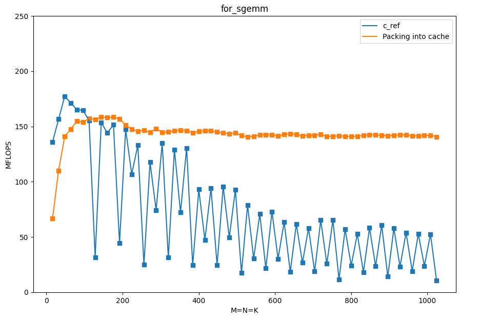
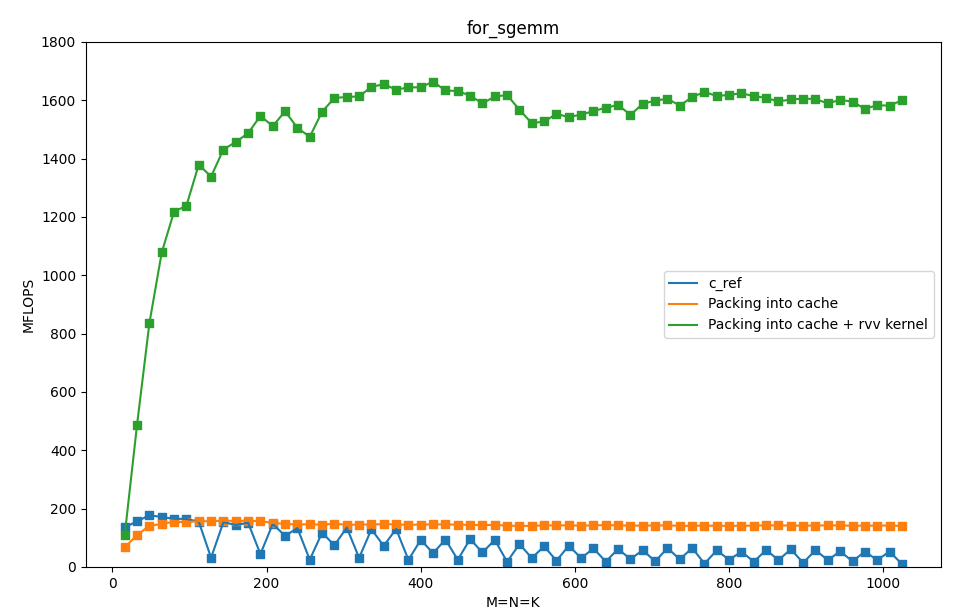

# riscv平台优化矩阵乘(基于blislab优化实践)

本文基于blislab与openblas项目，讲述在riscv平台上优化矩阵乘优化过程。

为了方便riscv-rvv加速，将blislab项目中的double数据类型改为float（即测试单精度浮点性能），且例子都是列主序的。

## 1 blislab项目

Blislab是一个开源教学项目，教你一步一步优化矩阵乘。项目地址：https://github.com/flame/blislab

在blislab项目的基础上，我进行了一些删减优化（删成最简的代码，只支持x86或riscv的linux OS），这样项目更清晰明了，方便入门。

**项目地址：**

~~~shell
https://github.com/surez-ok/blislab_riscv
~~~

上手请参照第3节[开始上手](#start)

## 2 优化步骤

**step0：循环交换:**

循环交换即交换嵌套循序，循环交换的主要目的是：对于多维数组的元素尽量能顺序访问。这样可以改善内存访问的空间局部性，对缓存更加友好，这种转换有助于消除内存带宽和内存时延瓶颈。

ref版本（基础版本）如下：

~~~c
void bl_sgemm_ref(
        int    m,
        int    n,
        int    k,
        float *XA,
        int    lda,
        float *XB,
        int    ldb,
        float *XC,
        int    ldc
        )
{
    // Local variables.
    int    i, j, p;
    float alpha = 1.0, beta = 1.0;

    // Sanity check for early return.
    if ( m == 0 || n == 0 || k == 0 ) return;

    // Reference GEMM implementation.
    // ijp
    for ( i = 0; i < m; i ++ ) {
        for ( j = 0; j < n; j ++ ) {
            for ( p = 0; p < k; p ++ ) {
                XC[ j * ldc + i ] += XA[ p * lda + i ] * XB[ j * ldb + p ];
            }
        }
    }
}
~~~

调整i、j、p的顺序，对结果没有影响，但是可以影响性能。

以下测试不同循环顺序的性能（m, n, k取256）

| 顺序 | 某款riscv芯片  |
| ---- | -------------- |
| ijp  | 25.63 MFLOPS   |
| ipj  | 14.89   MFLOPS |
| jip  | 26.22 MFLOPS   |
| jpi  | 159.87 MFLOPS  |
| pij  | 14.92   MFLOPS |
| pji  | 147.96 MFLOPS  |

这样得到性能最高的循环顺序jpi，性能最差的循序为ipj

**原因分析：**

性能最好的jpi模式的代码如下：

~~~c
void bl_sgemm(
    int    m,
    int    n,
    int    k,
    float *A,
    int    lda,
    float *B,
    int    ldb,
    float *C,        // must be aligned
    int    ldc        // ldc must also be aligned
)
{
  int    i, j, p;

  // Early return if possible
  if ( m == 0 || n == 0 || k == 0 ) {
    printf( "bl_sgemm(): early return\n" );
    return;
  }
  // jpi
  for ( j = 0; j < n; j ++ ) {              // Start 2-nd loop
      for ( p = 0; p < k; p ++ ) {          // Start 1-st loop
          for ( i = 0; i < m; i ++ ) {      // Start 0-th loop
              //C[ j * ldc + i ] += A[ p * lda + i ] * B[ j * ldb + p ];
              C( i, j ) += A( i, p ) * B( p, j ); //Each operand is a MACRO defined in bl_sgemm() function.

          }                                 // End   0-th loop
      }                                     // End   1-st loop
  }                                         // End   2-nd loop
}
~~~

考虑内存循环jpi的计算过程，如下图：

很显然，jpi顺序适合cache预取，这种方式的一级缓存命中率高于ipj模式。

测试ipj顺序在不同数据规模下的表现，从图中可以看出，随着数据规模增大，整体性能在下降（中间的抖动可能与cache换出换入有关）

可以看到：随着数据规模增加，flops将会衰减（测试ipj模式是因为这种模式会较快的达到cache限制，方便测试，jpi性能图如下图类似，只是达到性能下降较慢）

**为什么矩阵变大后flops会快速衰减呢？**

当A、B 矩阵小于 L2 cache 时，gemm只需要从 DDR中读取 A、B 大小的内存；但是当 AB 大于 L2 cache 时，由于行主序的 B 或者列主序的 A 不是内存连续的，gemm从 DDR读取的内存数超过 A、B 的大小，造成cache miss增加，于是性能恶化。

**step1：基本的分块:**

解决step0中的问题，一个解决思路是：将大矩阵拆分为小矩阵，这样小矩阵可以完全放到cache中。

基本分块：

先将矩阵分块（m n方向进行分块，k方向不分块），然后展开：

如下图所示：

A矩阵沿着m方向分块，每个小矩阵为 （MR， k）

B矩阵沿着n方向分块，每个小矩阵为 （ k， NR）

小矩阵（MR， k）与 小矩阵 （ k， NR）相乘得到C中的小块矩阵（MR，NR），如小黄

依次类推...

写成如下方式：

~~~c
void AddDot( int k, float *A, int lda, float *B, int ldb, float *result ) {
  int p;
  for ( p = 0; p < k; p++ ) {
    *result += A( 0, p ) * B( p, 0 );
  }
}

void AddDot_MRxNR( int k, float *A, int lda, float *B, int ldb, float *C, int ldc )
{
  int ir, jr;
  int p;
  for ( jr = 0; jr < DGEMM_NR; jr++ ) {
    for ( ir = 0; ir < DGEMM_MR; ir++ ) {
      AddDot( k, &A( ir, 0 ), lda, &B( 0, jr ), ldb, &C( ir, jr ) );
    }
  }
}

void bl_sgemm(
    int    m,
    int    n,
    int    k,
    float *A,
    int    lda,
    float *B,
    int    ldb,
    float *C,        // must be aligned
    int    ldc        // ldc must also be aligned
)
{
    int    i, j, p;
    int    ir, jr;

    // Early return if possible
    if ( m == 0 || n == 0 || k == 0 ) {
        printf( "bl_sgemm(): early return\n" );
        return;
    }

    for ( j = 0; j < n; j += DGEMM_NR ) {          // Start 2-nd loop
        for ( i = 0; i < m; i += DGEMM_MR ) {      // Start 1-st loop
            AddDot_MRxNR( k, &A( i, 0 ), lda, &B( 0, j ), ldb, &C( i, j ), ldc );
        }                                          // End   1-st loop
    }                                              // End   2-nd loop

}
~~~

其中AddDot_MRxNR函数完成(MR, k)与 (k, NR)矩阵的乘法。

可以测试MR NR不同的取值的性能，可见：仅仅进行简单分块并不能提高性能，因为其循环层增加了，并且计算时是等价的，需要进一步优化。

比如：mr = 2,  nr = 2的代码：

使用一些优化技巧：

1. 循环展开
2. 寄存器缓存（寄存器结果重复利用）

mr = 2 nr = 2 （unrool版本）代码如下：

~~~c
void AddDot_2x2( int k, float *A, int lda, float *B, int ldb, float *C, int ldc )
{
   register float C00 = 0.0f, C01= 0.0f, C10= 0.0f, C11 = 0.0f;
   int p;
   for (p = 0; p < k; p++) {
     C00 += A(0, p) * B(p, 0); 
     C01 += A(0, p) * B(p, 1);
     C10 += A(1, p) * B(p, 0);
     C11 += A(1, p) * B(p, 1);
   }
   C(0, 0) += C00;
   C(0, 1) += C01;
   C(1, 0) += C10;
   C(1, 1) += C11;
}

void bl_sgemm(
    int    m,
    int    n,
    int    k,
    float *A,
    int    lda,
    float *B,
    int    ldb,
    float *C,        // must be aligned
    int    ldc        // ldc must also be aligned
)
{
    int    i, j, p;
    int    ir, jr;

    // Early return if possible
    if ( m == 0 || n == 0 || k == 0 ) {
        printf( "bl_sgemm(): early return\n" );
        return;
    }

    for ( j = 0; j < n; j += 2 ) {          // Start 2-nd loop
        for ( i = 0; i < m; i += 2 ) {      // Start 1-st loop
           AddDot_2x2( k, &A( i, 0 ), lda, &B( 0, j ), ldb, &C( i, j ), ldc );
        }                                   // End   1-st loop
    }                                       // End   2-nd loop
}
~~~

测试结果如下：

可见：当矩阵规模较少（k较小）时，unrool版本比ref版本有1x以上提升，但是当矩阵超过一定规模后，性能避免不了的还是下降了，这是因为当k比较大时，矩阵分成的小矩阵在cache里放不下了，所以需要更优的分块方式。

**step2：cache级别的分块：**

step2相较于step1的区别是：在k方向上也进行了分块。

解决思路依旧是：

将大矩阵拆分为小矩阵，保证小矩阵能放在cache里，这样可以提高访问性能。

下图示例表示分块原理：

所以，可以将大矩阵拆为小矩阵，确保分割后的小矩阵可以全部放到cache中，然后访问。

其伪代码如下：

~~~c
	for jc = 0; jc < n; step = NC
		for ic = 0; ic < m; step = MC
            for pc = 0; pc < k; step = KC
				pack_A(ic, pc)                   // 准备好pack_A矩阵
                pack_B(pc, jc)                   // 准备好pack_B矩阵
                Kernel_op(A(ic, pc), (pc, jc))   // 计算pack_A * pack_B
             endfor
         endfor
      endfor
~~~

上述操作可以进行优化（尽量减少内存循环计算量）。

~~~c
	for jc = 0; jc < n; step = NC                      // loop5
        for pc = 0; pc < k; step = KC                  // loop4
            pack_B(jc, pc)
            for ic = 0; ic < m; step = MC              // loop3
                pack_A(ic, pc)
                Kernel_op(A(ic, pc), (pc, jc))         // macro-kernel Loop2-loop0
            endfor                                     // loop3
        endfor                                         // loop4
     endfor                                            // loop5
~~~

其流程如下(来自openblas流程图)：

以上参数需要满足一定的限制：

~~~sh
MC * KC  小于L2的1/2
~~~

**实际测试：**

从下图测试数据可以看到（见橙色部分），基于step2进行分块后，随着数据规模增大，flops可以保持稳定；

**step3：kernel使用SIMD指令优化：**

对于step2中的micro kernel部分，可以使用riscv rvv指令优化kernel乘法。

测试结果如下，可见与step2相比，使用rvv指令优化有巨大的提升：

## 3 开始上手

以step0为例（其它几个例子也是相同操作）：

~~~shell
$ cd step0

# 编译，默认是intel平台，gcc编译
# 如果需要编译riscv平台，需要修改Makefile，将Makefile的前几行中 CROSS_COMPILE 配置为正确的交叉编译器
$ make

# 测试
$ bash run_bl_sgemm.sh
~~~

